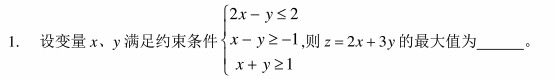
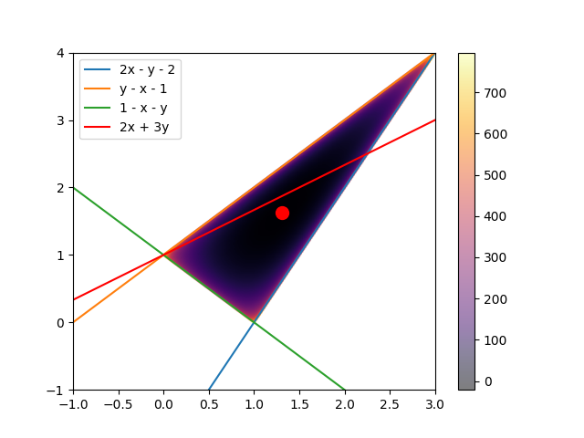
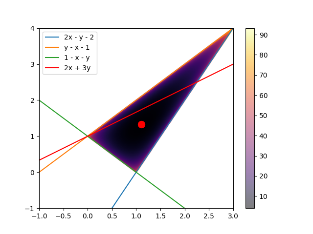
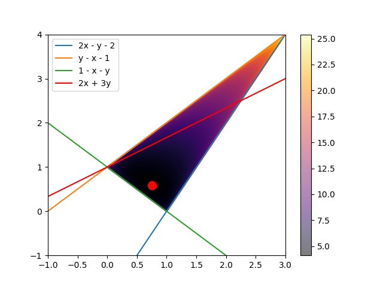
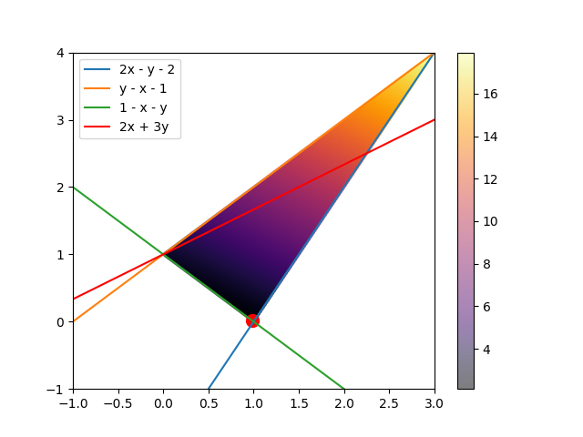
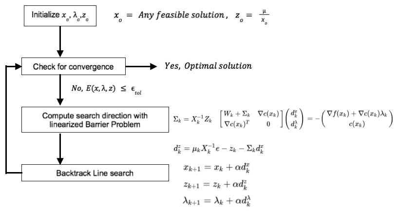

# 内点法
普通的二次罚函数法也叫做外罚函数法，是一种基于二次罚函数的优化方法。因为它对每一步解的范围没有要求，从求解过程来看，其产生的解的序列极有可能是从约束范围之外慢慢接近约束边界。
内点法,也常叫做障碍函数法，是一种基于内罚函数的优化方法，它要求解的序列必须位于约束范围内。内点法在求解过程中，每次迭代的解必须位于约束范围内，否则会得到一个系统错误。  
对于一般的优化问题：
$$ \min f(x) $$
$$ \text{s.t. } x \in \mathcal{C} $$
Interior method typically employ a two-phase approach:
- first phase to find a feasible solution 
- second phase to refine the solution to optimality.  

## 约束优化问题
  约束优化问题的一般形式为：
  $$ \min f(x) $$
  $$ \text{s.t. } g_i(x) \leq 0, i = 1, \ldots, m $$
  $$ h_j(x) = 0, j = 1, \ldots, p $$

  - 目标函数 f(x)， 约束函数 g_i(x)， 边界条件 h_j(x) 可以是线性函数，也可以是非线性函数。
  - 通常都是凸函数，对应着凸优化问题。
  - 用松弛变量法将任意形式的不等式约束转化为简单的不等式约束。

## 松弛变量法
对于约束优化问题中的不等式约束 $g_i(x) \leq 0, i = 1, \ldots, m$, 可以转化为另一种形式：$g_i(x) + s_i = 0, i = 1, \ldots, m$, 其中 $s_i \geq 0, i = 1, \ldots, m$，这样我们就可以把一般形式的约束优化问题，转化为简单的约束优化问题：
$$ \min f(x) $$
$$ \text{s.t. } g_i(x) + s_i = 0, i = 1, \ldots, m$$ 
$$ h_j(x) = 0, j = 1, \ldots, p $$
$$ s_i \geq 0, i = 1, \ldots, m $$

## 障碍函数法
当我们通过松弛变量法得到了更加简单的约束优化问题的表达形式后，我们发现，约束条件中还是有意向不等式约束$s \geq 0$，这时，我们可以使用障碍函数法来解决。我们希望得到一个关于s的函数,满足当$s<0$时，$I_(s) = 0$， 当$s \geq 0$时，$I_(s) = +\infty$。 我们把这个函数加到目标函数中，得到新的目标函数。这个函数的最优值就是我们希望得到的满足约束$s\geq 0$ 目标函数的最小值。
$$ Obj(x, s) = f(x ) + I^*s(x) $$

如何才能逼近这种函数呢？天然的我们想到了对数函数：$log(x)$的性质，我们构建一个对数函数: $-t *log(s)$ 其函数图像：

当s 越接近0时，所构建的函数越接近无穷。   
理论上来说，一个$t_i$可以对应一个解$x^*_{ti}$, 当t连续变换时，所对应的解$x^*_{ti}$形成的路径，就叫做中心路径[central path]  
以高中的线性规划题目为例：
  

$$
\min 2x + 3y \\
s.t. \\
2x -y - 2 \leq 0 \\
y - x - 1 \leq 0 \\
1 - x - y \leq 0
$$  
我们构造其障碍函数优化问题：
$$\min f(x) = 2x + 3y - t*\log(-(2x -y - 2)) - t*\log(-(y - x - 1)) - t*log(-(1 - x - y))$$  
当t = 100时，图像为：  
  
当t = 10时，图像为：  
  
当t = 1时，图像为：  
  
当t = 0.1时，图像为：  
  
当t = 0.01时，图像为：  
   
图中红色点移动的路径即为中心路径。确实是从内部出发，逐步移动到边界点上. 即，这是内点法的一种。

## 障碍函数法的KKT条件
通过障碍函数法，我们将原来的一般约束优化问题，转化为了一个简单的约束优化问题：
$$ \min f(x) - \mu *ln(s) $$
$$ \text{s.t.} g_i(x, s) = 0 $$
注意，上面问题的不等式约束已经通过松弛变量法转化成了等式约束。因此产生的新的约束$s > 0$也转化成了障碍函数的形式，叠加在了目标函数上。  
我们得到这个问题的拉格朗日函数为：
$$ L(x,s, \lambda, \mu) = f(x) - \mu *ln(s) + \lambda^T(g_i(x)) $$
$$ L(\bar x, \lambda, \mu) = f(\bar x) - \mu *ln(\bar x) + \lambda^T(g_i(\bar x)) \\ a.t. \quad \bar x = \begin{bmatrix} x \\ s \end{bmatrix} $$
满足其最优性一阶条件的kkt点：  
$\nabla L = \nabla f(\bar x^*) - \frac{\mu^*}{\bar x^*} + \lambda^* \nabla g_i(\bar x^*) = 0 $  
说明，障碍函数法对应优化问题的对偶问题的解 $\mu^*$ $\lambda^*$，也完全可以使得它们属于原目标函数的对偶问题的解。   
令： $Z = \{z_i = \frac{\mu}{\bar x_i} | i = n..m \}$我们写出这个问题的KKT条件为：
$$ \nabla f(\bar x) - Z + \lambda \nabla g_i(\bar x)= 0 $$
$$ g_i(\bar x) = 0 $$
$$ \bar x * Z  - \mu = 0 $$

## 用newton法求解 障碍函数的KKT条件

$$ L(\bar x, \lambda, \mu) = f(\bar x) - \mu *ln(\bar x) + \lambda^T(g_i(\bar x)) $$
$$
\frac{\nabla L}{\nabla \bar x} = \nabla f(\bar x) - Z + \lambda \nabla g_i(\bar x) \\
\frac{\nabla L}{\nabla \lambda} = g_i(\bar x) \\
\frac{\nabla L}{\nabla \mu} = \bar x * Z - \mu $$ 
计算L的Hessian矩阵：  

$$ \begin{aligned}
\nabla^2_{\bar x \bar x} L &= \nabla^2_{\bar x \bar x} (\nabla f(\bar x) - Z + \lambda \nabla g_i(\bar x))  = W_{\bar x \bar x}\\
\nabla^2_{\bar x \lambda} L  &= \nabla g_i(\bar x) \\
\nabla^2_{\bar x Z} L &= -I \\
\nabla^2_{\lambda Z} L  &= 0 
\end{aligned} $$
可以得到Hessian矩阵为: 
$$ 
\begin{aligned}
\nabla^2_ L &= \begin{bmatrix}\nabla^2_{\bar x \bar x} L & \nabla^2_{\bar x \lambda} L & \nabla^2_{\bar x Z} L \\
\nabla^2_{\lambda \bar x} L & \nabla^2_{\lambda \lambda} L & \nabla^2_{\lambda Z} L \\
\nabla^2_{Z \bar x} L & \nabla^2_{Z \lambda} L & \nabla^2_{Z Z} L \\
\end{bmatrix} \\
&= \begin{bmatrix}
   W_{xx} & \nabla g_i(\bar x) & -I \\
   \nabla g_i(\bar x)^T & 0 & 0 \\
   -I & 0 & 0
\end{bmatrix}
\end{aligned}
$$  
根据经典牛顿法的更新格式：  
$$x^{k+1} = x^k - \bigtriangledown^2 f(x^k)^{-1} \bigtriangledown f(x^k)$$  
可以得到,在第k步中,  $\bar x$, $\lambda$和 $Z$的更新公式为：
$$
\begin{aligned}
\bar x^{k+1} &= \bar x^k -(\nabla^2_ L)^{-1} * \nabla_{\bar x} L \\
\lambda^{k+1} &= \lambda^k - (\nabla^2_ L)^{-1} * \nabla_{\lambda} L \\
Z^{k+1} &= Z^k -(\nabla^2_ L)^{-1} * \nabla_{Z} L
\end{aligned}
$$
那么可知:  
$$
\begin{bmatrix}
   W_{xx} & \nabla g_i(\bar x) & -I \\
   \nabla g_i(\bar x)^T & 0 & 0 \\
   -I & 0 & 0
\end{bmatrix} * \begin{bmatrix} d\bar x^{k} \\ d\lambda^{k} \\ dZ^{k} \end{bmatrix}  = - \begin{bmatrix}\nabla f(\bar x) - Z + \lambda \nabla g_i(\bar x) \\ \nabla g_i(\bar x) \\ \bar x * Z - \mu \end{bmatrix}
$$d
其中， $d\bar x^{k+1} \quad d\lambda^{k+1} \quad dZ^{k+1}$ 分别是变量$\bar x, \lambda, Z$ 的更新方向，$W_{\bar x \bar x}$ 是拉格朗日函数L的雅克比矩阵。  

因此，$W_{\bar x \bar x} = \nabla^2_{\bar x \bar x} L = \nabla^2_{\bar x \bar x} (\nabla f(\bar x) - Z + \lambda \nabla g_i(\bar x))$, $Z_k = \begin{bmatrix}z_1 & 0& 0 \\ 0 & ...&0\\0&0&z_n \end{bmatrix}$, $X_k = \begin{bmatrix}\bar x_1 & 0&0 \\  0 & ...&0 \\ 0&0&x_n \end{bmatrix}$

以上还可以写成：
$$
\begin{bmatrix}
   W_{xx} + \sum_k & \nabla g_i(\bar x) \\
   \nabla g_i(\bar x)^T & 0 \\
\end{bmatrix} * \begin{bmatrix} d\bar x^{k} \\ d\lambda^{k} \end{bmatrix} = - \begin{bmatrix}\nabla f(\bar x) - Z + \lambda \nabla g_i(\bar x) \\ \nabla g_i(\bar x) \\ \end{bmatrix} \\
\sum_k = X^{-1}_k Z_k 
$$
这样，我们就可以再得到 $d\bar x^{k}$， 和$ d\lambda^{k}$ 以后，直接得到：
$$ dZ_{k} = \mu_k  * X^{-1}_k - Z_k - \sum_{k} $$

### 步长
当我们找到了搜索方向后，我们就可以计算出步长了。目的是找到一个合适的步长值，使得目标函数尽量的减小，并且约束的违反程度尽可能小。通常有两种方法来确定步长：  
1. 评价函数[metric function]: 评价函一般取目标函数和约束违反度绝对值乘以一个系数之和， mertric function = $f + v * \sum |c(x)|$
2. 滤波法：滤波法使用目标函数与约束度结合来确定是否接受步长。

一旦步长确定了，我们就可以得到下一步的迭代点：  
$\bar x_{k+1} = \bar x_k + \alpha_k d \bar x_k$  
$\lambda_{k+1} = \lambda_k + \alpha_k d\lambda^{k}$  
$Z_{k+1} = Z_k + \alpha_k dZ_k$

### 收敛准则  
收敛准则可以定义为在一定的容差范围内，满足了KKT条件，则称该问题已收敛:  
$\max |\nabla^2_{\bar x \bar x} (\nabla f(\bar x) - Z + \lambda \nabla g_i(\bar x))| < \epsilon $  
$\max|c(x)| < \epsilon$  
$\max|XZ - \mu| < \epsilon$

## 计算流程

- 在可行域内寻找一个初始点 $\bar x_0$， 通过求解上面的方程来得到 $\lambda_0$ he $Z_0$
- 检查是否满足收敛条件，如果满足则返回结果，不满足则进入下一步
- 通过解方程组得到搜索方向
- 用评价函数或滤波法，通过逐步减少$\alpha$来执行回退线搜
- 通过搜索方向和$\alpha$来更新点，返回到第二步。

## 

